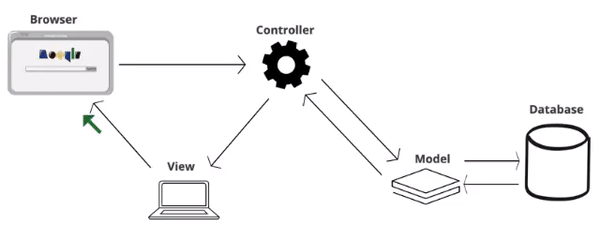

<h1>Drone Dynamics</h1>

Drone Dynamics is a popular business based out of Delhi and is known for its work on
Drone technology which retreats ceremonies in different parts of India. 
They provide Drone Light shows for both indoor and outdoor ceremonies.

<h3>What are drone light shows?</h3>

Drone Light Shows are a combination of drones programmed to fly in 3D space to make 
identifiable visual forms. To do this an animation is prepared based on the requirements 
of the client. Drone light shows are also an eco-friendly alternative to fireworks. 
Apart from that drone light shows can also be used to deliver messages to a large audience.

You are going to build a Spring Boot application to effectively manage the clients and drone 
show event bookings in this series of learning.

Let's get started with the tasks!.. 
We are going to create an application using the MVC pattern

<ul>
<li>The 'DroneController' can 'Transceive' requests and responses</li>
<li>The 'DroneRepository' can encapsulate the logic required to access data sources </li>
</ul>

It's time to recall how we might interact with these classes in a 'non-Spring' way right?

In the main class 'SpringDependencyInjectionApplication.java', we would create an instance of the 
'DroneController.java' class to interact with it.

	@SpringBootApplication
    public class SpringDependencyInjectionApplication {
        public static void main(String[] args) {
		var droneController = new DroneController();
	    }
    }

But what if this controller is dependent on another class? Because a controller in an MVC world
is just a thin layer. It should be dumb and just be enough to accept requests and return responses. The 
business logic required to access the data should be delegated off to the repository('DroneRepository') 
layer.

<!-- Task 1 -->

Let's do the following,

<ul>
<li>Define the reference for 'DroneRepository' in the 'DroneController' class  
<i style="color:red">
hint : intelliJ will yell at you at the moment to create a constructor parameter 
for the reference 'DroneRepository' (which has private access)
</i></li>
<li>Create a constructor that takes in the parameter for the recently defined DroneRepository reference</li>
</ul>

But now are we at the 'Spring-Road' and started our journey yet?  
Naahh!.. We just have a regular class (DroneController) which has a constructor that takes in 
the parameter(DroneRepository)

Let's go back to our 'SpringDependencyInjectionApplication' class and create a reference for
'DroneController'

    DroneController droneController = new DroneController(droneRepository);

<i style="color:red">
Meh! Again a red-flag from intelliJ! This time it requires the reference for the 'droneRepository'
</i>

Let's create one!
    
    DroneRepository droneRepository = new DroneRepository(); 
    DroneController droneController = new DroneController(droneRepository);

<ul>
<li>Let's define a method('next()') that returns a String("Next Drone") in the 'DroneController' class</li>
<li>In the 'SpringDependencyInjectionApplication' let's call the recently defined 'next()' method
to display the return value
</li>
</ul>

    DroneRepository droneRepository = new DroneRepository();
    DroneController droneController = new DroneController(droneRepository);
    System.out.println(droneController.next());

Let's run the application!

 &nbsp; Hurrah!.. You've got the output!..
Everything works fine in the application!..

But, wait for a moment!.. Does Spring know about these classes that we have created?

Oops!.. Not yet.. 

Also, this was easier to keep track of dependencies between these classes in this simple context.
But imagine if this context expands and becomes much more complex and multiple classes are dependent 
on each other, and you have to take care of the instantiation of these classes at multiple places of
your application.

This is when Spring says "Hey pal!.. Don't worry! I've got your back!.."

There is a special way to tell Spring to take care of these dependencies. Upon informing Spring, it will
create <em>beans</em> that are managed by the <em>Application Context</em> 

 &nbsp; 
The <em>Application Context</em> contains pool of beans to which we can get access to. 
Let's see how in a short-while.

<h2>What is dependency injection?</h2>

In the recently completed task, the <em>DroneController</em> was dependent on the 
<em>DroneRepository</em> class. So we created a dependency for <em>DroneRepository</em> 
inside the <em>DroneController</em> class. Here, creating a dependency would literally mean
that we were getting the instance of 'DroneRepository' into the 'DroneController' class.
Similarly in any particular context the dependency is injected wherever it is necessary.

<h2>Inversion of Control</h2>

But how will Spring take care of <em>Dependency Injection</em>?

Here comes the role-reversal.

Instead of us creating the instances and injecting the dependencies, Spring does it for us.
The control has been given to Spring as per the Inversion of Control principle.

 &nbsp;

Now let's just go ahead and tell Spring to take care of this hassle.

<ul>
<li>Let's go to the 'DroneController' class and add <em>@RestController</em> annotation

    @RestController
    public class DroneController { ... }

Take a moment to explore on the <em>@RestController</em> annotation and Components.

</li>
<li>Let's go to the 'DroneRepository' class and add <em>@Repository</em> annotation

    
    @Repository
    public class DroneRepository { ... }

Take a moment to explore on the <em>@Repository</em> annotation and Components.

</li>
</ul>

